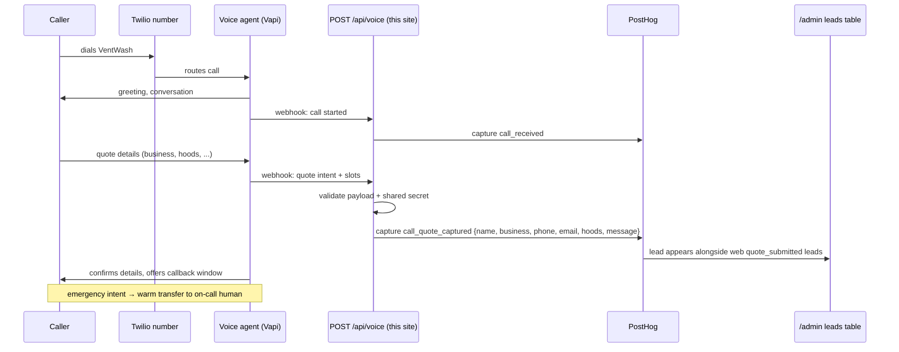

# AI Voice Answering — Implementation Plan

Status: **planned** (v-next). The webhook landing zone already exists as a stub at `src/app/api/voice/route.ts` (returns `501`).

VentWash misses calls. Restaurant managers call after close (10pm–1am), during lunch rush, and on weekends — exactly when nobody picks up. Every missed call is a quote that goes to whichever competitor answers. This plan adds an AI phone agent that answers every call, captures quote requests into the **same lead pipeline as the website's quote form**, and hands real emergencies to a human immediately.

## Goals

1. **24/7 answering** — every call answered within 2 rings, no voicemail dead ends.
2. **Quote intake** — collect the same fields the web form collects (`name`, `business`, `phone`, `email`, `hoods`, `message`) and push them through the existing `quote_submitted`-style pipeline so phone leads and web leads live in one place: the `/admin` leads table.
3. **Callback scheduling** — when a caller wants to talk to a person, capture a preferred callback window instead of losing them.
4. **Emergency / after-hours routing** — grease fire, failed inspection tomorrow, hood down before service: transfer to the on-call human immediately, at any hour.

Non-goals for v1: taking payments over the phone, live calendar booking, outbound calling.

## Approach comparison

Three realistic ways to build this:

| | (a) Vapi (managed voice-agent platform) | (b) Retell AI | (c) DIY: Twilio Media Streams + Deepgram + Claude + ElevenLabs |
| --- | --- | --- | --- |
| **What it is** | Hosted agent: you define prompt, tools/webhooks, voice; Vapi runs telephony + STT + LLM + TTS | Similar managed stack, strong conversation-flow tooling and call analytics | We orchestrate everything: Twilio streams audio, Deepgram does STT, `claude-sonnet-5` (Anthropic API) drives the conversation, ElevenLabs speaks |
| **Cost (approx.)** | ~$0.05/min platform + provider passthrough (LLM/TTS/telephony) ≈ **$0.10–0.20/min** all-in | Similar: ≈ **$0.08–0.20/min** all-in depending on voice/model choices | Raw components ≈ **$0.04–0.10/min** (Twilio ~$0.01, Deepgram ~$0.005, LLM ~$0.01–0.03, ElevenLabs ~$0.02–0.06) — but you pay in engineering time |
| **Latency** | Good (sub-second turn-taking, tuned pipeline out of the box) | Good (comparable; purpose-built for phone latency) | You own it — can be best-in-class or terrible; achieving <800 ms turn latency is real work (streaming everywhere, barge-in handling, endpointing) |
| **Control** | Medium — prompt, tools, voices, some pipeline knobs | Medium — similar, plus flow-builder guardrails | Total — every token, every ms, custom barge-in, custom slot logic |
| **Build effort** | **Days.** Console config + one webhook on our site | **Days.** Same shape | **Weeks.** WebSocket audio server, streaming STT/LLM/TTS glue, interruption handling, retries, monitoring, on-call for your own telephony stack |
| **Lock-in** | Prompt + webhook are portable; platform config isn't | Same | None |

**Recommendation: (a) managed platform (Vapi) for v1.** The webhook contract we build (`POST /api/voice`) is identical regardless of platform, so nothing is wasted. Retell is a fine substitute if its pricing/voices fit better at trial time — evaluate both in week 1, they're interchangeable at our scale. **DIY (c) is the v2 path** if call volume grows to the point where per-minute platform margin matters (roughly >2,000 min/month, where saving ~$0.08/min ≈ $160+/month starts to justify maintenance) or we need conversation behavior the platforms can't express.

## Architecture

The voice platform owns the phone call; our site owns the lead. One webhook connects them, and phone leads land in the exact same `/admin` table as web quotes.

Key decisions:

- **`POST /api/voice`** is the single integration point. It validates a shared secret header (platform-configured), validates the payload shape, and captures PostHog events server-side via `posthog-node` — the same mechanism the web quote form uses, so ad-blockers and client failures are irrelevant.
- **Events:** `call_received` (every call: caller number hash, duration, intent, after_hours flag) and `call_quote_captured` (same lead fields as web `quote_submitted`: `name`, `business`, `phone`, `email`, `hoods`, `message`, plus `source: 'phone'`).
- The `/admin` leads table already queries lead-shaped events from PostHog; adding `call_quote_captured` to its query means **zero new UI** — phone leads simply appear next to web leads, distinguishable by source.
- The stub route ships now so the URL is stable and deployable before the platform work starts.

## Conversation design

### Greeting

> "Thanks for calling VentWash — commercial kitchen hood and exhaust cleaning. I'm the after-hours assistant. I can get you a quote, schedule a callback, or get you to a person right away if this is urgent. What can I do for you?"

(During business hours, drop "after-hours"; the agent should state it is an automated assistant up front — callers punish discovering it mid-call.)

### Intents

| Intent | Agent behavior |
| --- | --- |
| **Quote request** | Slot-filling flow (below), confirm details back, promise a callback with a written quote within one business day. |
| **Reschedule existing job** | Capture business name + current appointment + preferred new window; flag for human confirmation. Never confirm a new time autonomously in v1. |
| **Emergency** (fire, smoke, hood failure before service, inspection tomorrow) | Skip everything; warm-transfer to on-call number. If no answer in 25 s, take a message, send SMS + email page to on-call, tell caller a human will call back within 15 minutes. |
| **Invoice / billing question** | Don't attempt answers. Capture business name + invoice number + question; route to office email; promise next-business-day response. |
| **Anything else / unclear** | One clarifying question, then offer callback capture. Never loop more than twice. |

### Required slots for a quote

1. **Business name**
2. **Callback phone number** (read back digit-by-digit to confirm)
3. **Address** (street + city — service-area check happens offline in v1)
4. **Number of hoods** (accept ranges; "not sure" is valid — record as unknown)
5. **Preferred time** for the follow-up call

Optional if offered: email, contact name, last cleaning date, cooking volume/type (affects NFPA 96 cleaning frequency). Ask for at most one slot per turn; accept multiple slots per answer.

### Escalation rules

- Any mention of **fire, smoke, burning smell, alarm** → emergency path immediately, no slot filling.
- Caller asks for a human twice, or expresses frustration → offer transfer (business hours) or top-priority callback (after hours).
- Agent confidence low / two consecutive misunderstandings → apologize once, capture name + number, end gracefully. Never argue.
- **Price questions:** the agent may state that typical hood cleanings start "in the few-hundred-dollar range per service" but must not quote a firm price — quotes come from a human.

### Compliance note — call recording consent

Several US states (California, Washington, Florida, Illinois, Pennsylvania, and others) are **two-party consent** states: recording a call without all parties' consent is unlawful. Before launch:

- Add a disclosure to the greeting: *"This call may be recorded for quality and to make sure we get your details right."* Continuing the call constitutes consent in most jurisdictions, but confirm with counsel for the specific operating states.
- If serving a two-party consent state, the disclosure is **mandatory**, not optional.
- Retain recordings/transcripts per a defined policy (suggest: 90 days) and cover phone-captured personal data in the site's privacy policy.
- Do not capture payment card data by voice (keeps us out of PCI scope).

## Phased rollout

| Phase | Scope | Duration | Est. monthly cost |
| --- | --- | --- | --- |
| **0 — Groundwork** (done) | Stub `POST /api/voice`, event vocabulary agreed, this plan | — | $0 |
| **1 — After-hours pilot** | Vapi agent + Twilio number, forward main line to agent only outside business hours; quote intent + emergency transfer only; webhook live, leads in `/admin` | 1–2 weeks build, 4 weeks pilot | ~$50–100 (≈300–500 min @ ~$0.15/min + $2 number) |
| **2 — Full-time + all intents** | Agent answers 24/7 as first line; reschedule + invoice intents; SMS confirmation to caller; `source` column in admin leads table | +2 weeks | ~$150–400 (≈1,000–2,500 min) |
| **3 — Evaluate DIY (v2)** | If volume >~2,000 min/mo or platform limits bite: Twilio Media Streams + Deepgram + `claude-sonnet-5` + ElevenLabs behind the same webhook | 4–6 weeks eng | ~$100–250 at same volume (plus maintenance time) |

Success metrics (all measurable in PostHog since every call emits events): answered-call rate, quote-capture rate per call, emergency transfer success rate, and phone-lead → job conversion vs. web leads.
